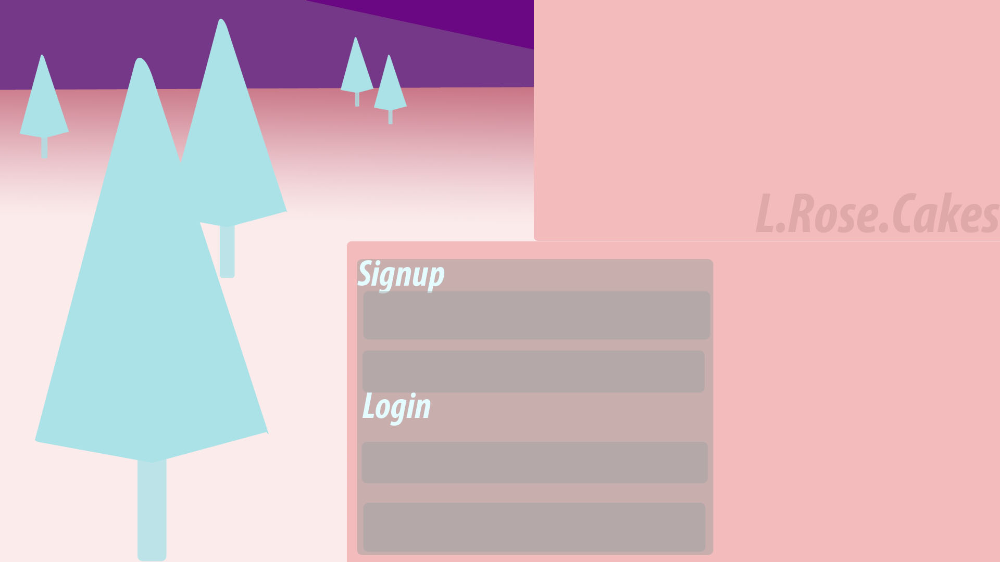
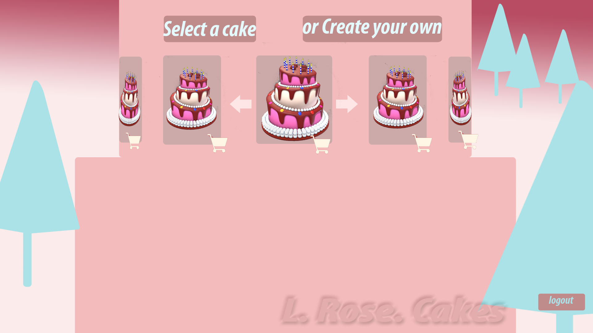
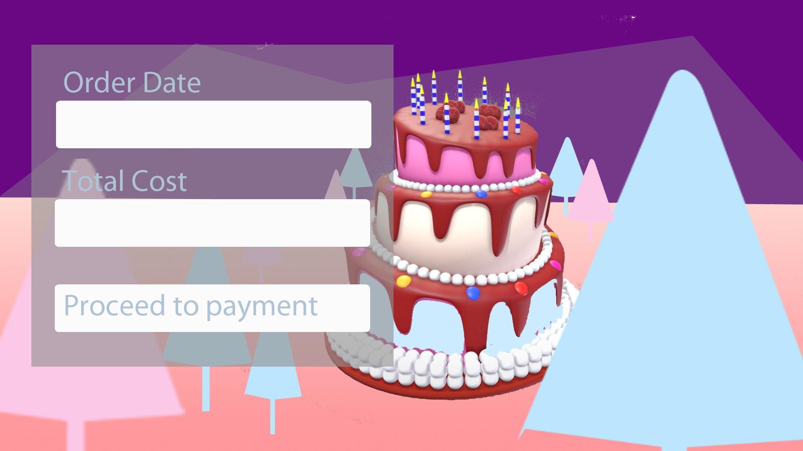
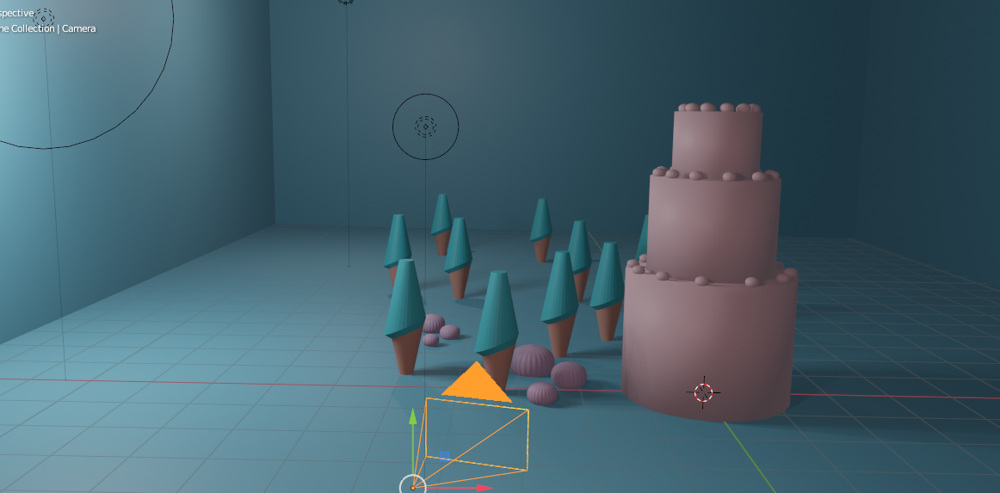
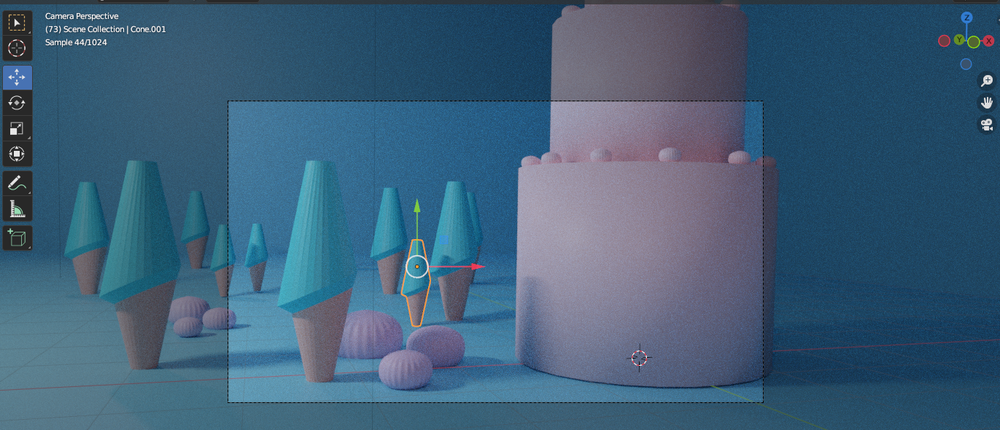
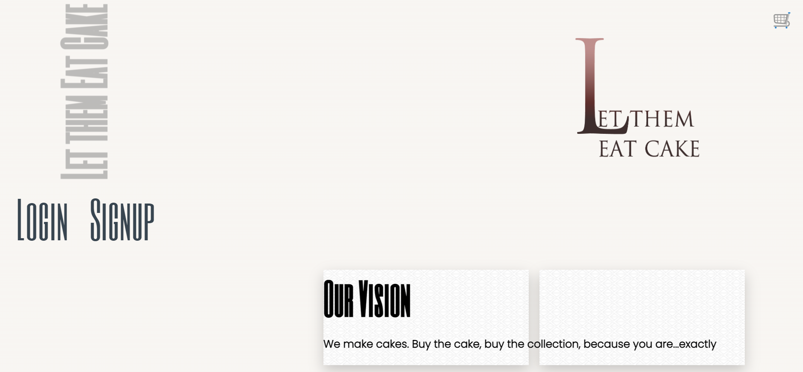
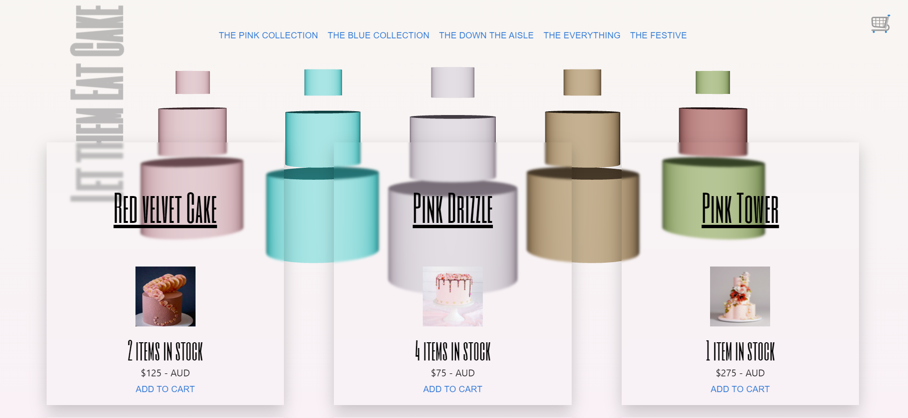

# cakeECommerce

   

- Link: https://letthemeatcake.herokuapp.com/
- Repo: https://github.com/liamok19/cakeECommerce

## Contributor/s
1. Liam O'Kane - MERN and THREE.js  
    1. Github: https://github.com/liamok19
    2. Email: liamokane19@gmail.com
    3. Portfolio: https://liamok19.github.io/liamokane_updated_portfolio/

## Table of contents
- [Description](#description)
- [License](#license)
- [UserStory](#userstory)
- [Concept](#concept)
- [Renders](#renders)
- [Usage](#usage)
- [Credits](#credits)

## License
This project is available under the MIT license. Visit [License: MIT](https://opensource.org/licenses/MIT) for full license text

## Description
# What is the app for?
Let them Eat Cake: A cake for every occasion. An online experience to purchase decadent creations by an Aussie suburban chef.
A user is prompted with a display of cakes which have been categorised. A user is able to add to cart but when be able to checkout unless they have signed up or logged in first. Once logged in and a cake/s has been chosen they're directed to a stripe payment method to add in their bank details. 

The payment will go through with a redirection to a success page and back to the homepage of the site. 

## UserStory
| When | Then | 
| ------------- |:-------------:| 
|**WHEN**  I visit the site for the first time | **THEN** I am presented with the homepage, which includes a login and signup; a vision from the service provider; and the option to add to cart from a list of cakes|
|**WHEN**  the User goes to the app they're prompted with a SignUp   | **THEN** the User needs to provide a Username, Email address, password |
|**WHEN**  the User goes to the app they're prompted with a Login   | **THEN** the User needs to provide Email address, password |
|**WHEN**  the User successfully signups or logs in they're directed to back to the homepage |  **THEN** the username of the User and logout button is featured |
| **WHEN**  the User is logged in they're prompted with 5 categories | **THEN** they have the option to chose what cake they want| 
| **WHEN**  the User is reviewing the cakes | **THEN** they're displayed a link to the details of the page, how much is left, the pricing  in AUD and a add to cart button|
|**WHEN** the User clicks on the cake of their chosing | **THEN** they're directed to the details of the page with a 'back to hoempage' if they require it otherwise they can add to cart from here |
| **WHEN**  the User is happy with the additions to the cart |**THEN** on the top SR of the screen they're prompted with cart |
| **WHEN** the User clicks the cart | **THEN** the order of each cake/s is displayed and ready to be checkout with
 |
| **WHEN**  the user is happy for checkout | **THEN** they're sent to a third party website to pay the price |
|**WHEN**  the payment has gone through | **THEN** the User will be redirected to the Success page |
| **WHEN**  the User is on the success page | **THEN** they're prompted with a a success message  |
| **WHEN**  the message has been read | **THEN** a setTimeout has been set to redirect the User back to the homepage |			
	
		
  

## Concept
   
   
   
   

## Renders 
# THREE.js Custom Scene
   
   

## Final Look
# Usage
   
   

## Credits
| Name | Link | 
| ------------- |:-------------:| 
| NPM - MDB | https://mdbootstrap.com/docs/standard/extended/to-do-list/  |
| freepik | https://www.freepik.com/free-vector/set-kids-helping-parents-with-home-cleaning_17962450.htm#query=kids%20chores&position=28&from_view=keyword | 

|||
| Build folder structure for client and server folders | Completed |
| Login page setup | Completed |

|||

Resources:
react three model setup
https://github.com/pmndrs/react-three-fiber

Fog -
https://github.com/pmndrs/react-three-fiber/discussions/1244
https://codesandbox.io/s/kt3uy?file=/src/index.js

camer positioning -
https://discoverthreejs.com/tips-and-tricks/

Mateiral UI (buttons) -
https://mui.com/material-ui/react-button/#main-content

Test Card Methos: 
https://stripe.com/docs/testing#cards

//several items in cart should add ontop of eachother

For later atas 
mongodb+srv://lokipoki:<password>@cluster0.hdhya.mongodb.net/myFirstDatabase?retryWrites=true&w=majority

